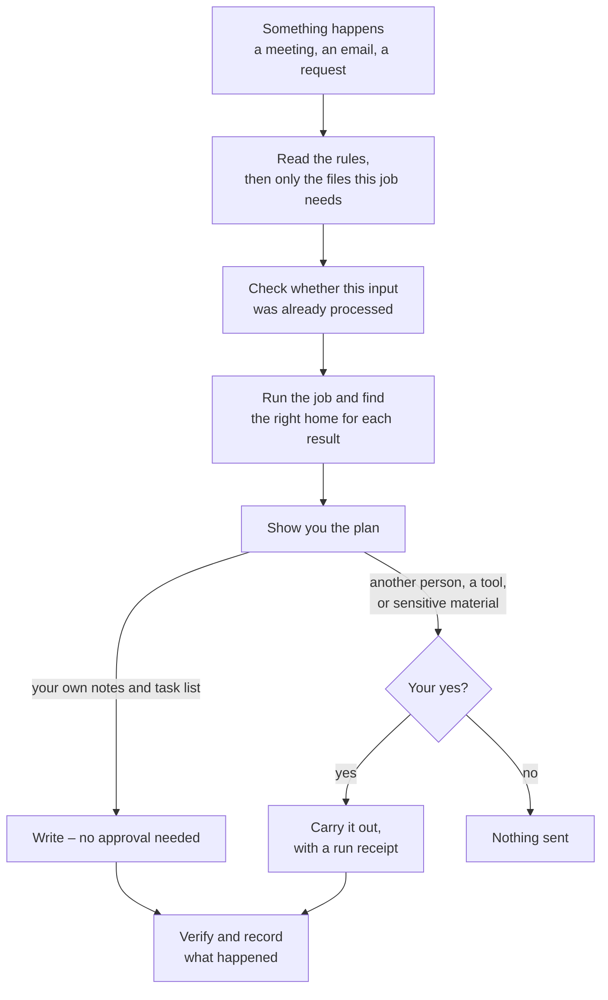

# AI Chief of Staff OS

**An open-source operating system that helps chiefs of staff manage meetings,
decisions, tasks, projects and follow-ups through an AI assistant.**

[](https://github.com/pragya-tewari/ai-chief-of-staff-os/actions/workflows/checks.yml)
[](LICENSE)

The hardest part of chief-of-staff work is rarely one task. It is holding the
context across many different kinds of work and knowing what needs attention
next.

In the same week, you may be tracking a founder decision, checking a delayed
project, preparing for a difficult conversation, following up after meetings,
reviewing hiring needs and writing an update for leadership. The notes may be in
a document, the task in a project tool, the decision in a chat and the history
in your head.

AI Chief of Staff OS gives your AI assistant a clear way to work across that
context. It helps turn meetings into actions, keep decisions and commitments on
record, review projects and prepare updates without starting from a blank prompt
every time.

It is built for the coordination side of the role across the organisation. It
is not an inbox assistant, a shared team platform or a replacement for a chief
of staff.

## What the OS actually is

The repository is made of Markdown files. You can open every rule, workflow and
template and see what the AI has been told to do.

There is no app, server, account or database in this project. To use it, you
need:

- an AI assistant that can work with files on your computer, such as Claude
  Code or an assistant that reads `AGENTS.md`; or
- a capable chat assistant where you can paste the generic instructions and
  attach the files it needs.

Connections to task, chat, mail, document and calendar tools are optional; the
workspace and built-in task list work without them.

See [supported assistants](docs/supported-assistants.md) for
the current support status.

## The 14 workflows

### Meetings and decisions

| Workflow | What it does |
|---|---|
| [meeting-to-tasks](jobs/meeting-to-tasks/how-to-do-it.md) | Turns a transcript into decisions, tasks, risks and open questions, then files each item in the right place |
| [prepare-a-meeting](jobs/prepare-a-meeting/how-to-do-it.md) | Builds a preparation pack from current decisions, commitments, risks and changes |
| [manage-a-decision](jobs/manage-a-decision/how-to-do-it.md) | Frames a decision, records what was agreed and keeps the reasoning available for later review |

### Projects, requests and reporting

| Workflow | What it does |
|---|---|
| [write-an-update](jobs/write-an-update/how-to-do-it.md) | Uses one set of facts to prepare an update for a team, founder, board or company |
| [run-a-sweep](jobs/run-a-sweep/how-to-do-it.md) | Reviews open loops, task quality, risks, dependencies and workload across the portfolio |
| [intake-a-request](jobs/intake-a-request/how-to-do-it.md) | Captures a request, decides whether to do, defer or decline it, and drafts the reply |

### Goals, money and capacity

| Workflow | What it does |
|---|---|
| [goals-and-numbers](jobs/goals-and-numbers/how-to-do-it.md) | Sets and reviews goals, then assembles the numbers needed to assess progress |
| [spend-check](jobs/spend-check/how-to-do-it.md) | Compares planned and actual spend and finds recurring costs that need attention |
| [capacity-and-headcount](jobs/capacity-and-headcount/how-to-do-it.md) | Reports current capacity, hiring needs and what they cost, so the hiring call stays yours |
| [protect-the-calendar](jobs/protect-the-calendar/how-to-do-it.md) | Compares where leadership time went with the priorities it was meant to support |

### People, communication and learning

| Workflow | What it does |
|---|---|
| [people-moves](jobs/people-moves/how-to-do-it.md) | Handles the operating work when someone joins, leaves or changes role |
| [draft-a-message](jobs/draft-a-message/how-to-do-it.md) | Drafts stakeholder communication in your voice and checks the risk before sending |
| [post-mortem](jobs/post-mortem/how-to-do-it.md) | Records what happened after a miss or incident and turns the learning into owned changes |
| [review-the-system](jobs/review-the-system/how-to-do-it.md) | Finds stale, missing, duplicated or misplaced information and proposes repairs |

You can change these workflows or add your own. The
[jobs guide](jobs/README.md) explains the shared structure.

## Start with the sample company

Clone the repository and run the installer:

```bash
git clone https://github.com/pragya-tewari/ai-chief-of-staff-os.git
cd ai-chief-of-staff-os
bash setup/install.sh
```

The installer asks where your private workspace should live, which assistant
you use and your timezone. It creates the workspace, connects it to the product
folder and checks that the setup is healthy.

Before adding your own work, try the OS with the fictional sample company:

```bash
bash setup/demo.sh
```

The demo creates an isolated copy of Northwind Learning and gives you the exact
prompt to run. It does not replace your own workspace or use real company
information.

After the demo, follow the [first-week guide](setup/first-week.md)
to set up your profile, priorities and working preferences.

Full installation details are in the
[setup guide](setup/install.md).

## The two-folder setup

The reusable OS and your private work live in separate folders:

```text
ai-chief-of-staff-os/          the public product: rules, workflows and templates
chief-of-staff-workspace/      your private workspace: projects, people, meetings and decisions
```

The product folder can receive public updates without touching your company
files. Your workspace holds the context that should never be included in a
public fork.

The installer offers an `--inside` option for people who prefer one folder. It
uses a fixed, git-ignored `workspace/` path, but the separate-folder setup gives
stronger protection against publishing private material by mistake.

## How a workflow runs

The repository calls each repeatable workflow a **job**. A job is a written
procedure for one kind of chief-of-staff work.

Every job follows the same basic loop:

1. Read the relevant rules and only the context needed for this request.
2. Check whether the same input was already processed.
3. Run the workflow and find the correct home for each result.
4. Show you the proposed external or sensitive actions.
5. Carry out only the actions you approve.
6. Verify the result and record what happened.

The same loop, as a picture:



Each job includes:

- when to run it;
- a step-by-step method;
- where each output belongs;
- what needs approval;
- a worked example; and
- a test showing what a correct result must include.

This means you are running the same procedure each time instead of rebuilding
the prompt from memory.

## Where your information goes

The workspace separates evidence, current state and views:

- **Evidence** records what happened: meeting notes, messages and source
  references.
- **Current state** records what is true now: projects, tasks, decisions, goals
  and people context.
- **Views** assemble information for a purpose: a meeting brief, founder update
  or list of commitments.

Each fact has one main home. A report can pull from that source, but it should
not become a second copy that slowly drifts out of date. Stable IDs link related
items across files.

The filing rules are documented in
[where things live](rules/where-things-live.md).

## What the AI can do without asking

Inside your ordinary workspace, the AI can read relevant files, organise
information, update your built-in task list and draft reports. These are records
you own and control.

It asks before:

- recording a decision as settled;
- reading or writing private and sensitive material;
- changing the rules or your saved preferences;
- creating or updating anything in an external tool; or
- sending, publishing or showing something to another person.

Sending external email, changing a task owner, editing financial figures,
deleting information, bulk-changing more than ten items and comparing named
people require a direct instruction from you.

The full policy is in
[what needs my approval](rules/what-needs-my-approval.md).

## How the system remembers and learns

The OS improves by keeping structured history instead of relying on one chat
thread:

- meeting records preserve decisions and commitments;
- project files preserve the reasoning behind changes;
- people files hold the working context needed to prepare conversations;
- corrections record what the AI got wrong; and
- approved repeated preferences become standing rules for later sessions.

The learning process never allows the AI to rewrite its own rules silently. It
proposes a change and waits for your approval.

See [how it compounds](docs/how-it-compounds.md) and
[how the AI learns](rules/how-you-learn.md).

## External tools and the built-in task list

The OS includes a local task list for your own commitments and follow-ups. It is
not a shared project board: nobody else updates it and it sends no reminders.

If your team uses Asana, Linear, Jira or another task tool, you can make that the
active task source instead. Only one task source should be active at a time.
The local list and an external board must not both claim to be current.

The repository includes connection guides for common tool categories. They
describe the expected actions and approval checks. They are not built-in
integrations. A connection works only when your AI runtime can access the tool
and you have configured it.

Start with [connection roles](connections/roles.md) and the
[built-in task list](connections/built-in-tasks.md).

## Technical structure

```text
ai-chief-of-staff-os/
├── rules/               behaviour, filing, approval and learning rules
├── jobs/                the 14 repeatable workflows
├── schemas/             shared formats for tasks, registers and run receipts
├── adapters/            instructions for different AI assistants
├── connections/         capability and tool-connection guides
├── setup/               installer, doctor, demo and workspace template
├── example-company/     fictional data for trying and testing the OS
├── docs/                architecture, support status, FAQ and threat model
├── CLAUDE.md            entry instructions for Claude Code
└── AGENTS.md            entry instructions for assistants that read AGENTS.md
```

For more detail, read the
[architecture](docs/architecture.md),
[security policy](SECURITY.md) and
[threat model](docs/threat-model.md).

## Limitations in v0.1

- The system is designed for one primary user and one active AI session at a
  time. It does not include multi-user or multi-agent locking.
- Jobs run when you start them. There is no background execution or reminder
  service unless your AI runtime provides one.
- Run receipts reduce duplicate actions after interruptions, but they do not
  provide database transactions or an exactly-once guarantee.
- The rules are instructions for the model, not enforced software permissions.
- Content read by a cloud AI provider is handled under that provider's account,
  retention, training and regional settings.
- Large workspaces may exceed an AI model's context. Jobs should read only the
  files they need.
- The installer supports macOS and Linux. Windows users need WSL or a compatible
  Bash environment.

## Contributing

The system is MIT licensed, readable and editable. You can change it for your
own work or contribute improvements to the public repository.

Read [CONTRIBUTING.md](CONTRIBUTING.md) before opening a
pull request. Security and privacy issues should follow the private reporting
process in [SECURITY.md](SECURITY.md).

## Who made this

Built and maintained by Pragya Tewari.
